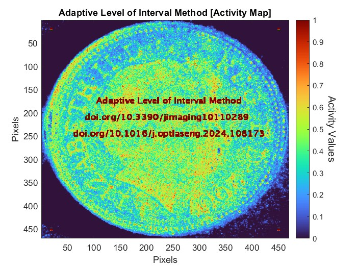

# ALI: The adaptive levels of interval method for processing laser speckle images with superior activity extraction and discrimination capabilities

This repository contains a Matlab implementation of the ALI: The Adaptive Levels of Interval Method.

Highlights:

* ALI method has been developed for processing speckle images with superior extraction and discrimination capabilities.
* This method is based on a novel mechanism that adapts the levels of interval between the speckle images.
* The evaluation results show high discrimination and activity extraction capabilities of this method against other methods.
* The results also validate its ability to deal with multi-spectral real speckle images with faster processing performance.

<p align="center"></p>


## Implementations

This method is implemented in the MATLAB programming language.

## Getting Started

The repository contains three MATLAB files.

* ALI.m : Implements the mathematical equations for the Adaptive Levels of Interval (ALI) Method.
* Speckles.mat : 3D Matrix file, contains 164 dynamic speckle patterns with resolutions of 470x470 pixels.
* Demo.m :  This file demonstrates the superior extraction and discrimination capabilities of the ALI method. It reads dynamic speckle patterns from the "Speckles.mat" file, processes them using the "ALI.m" function, and displays the extracted activity map.


## Paper Abstract

This paper describes the development of a new laser speckle imaging method for extracting speckle patterns' temporal activity information with superior extraction and discrimination capabilities. It is based on a novel mechanism which uses the speckle images, in an unconventional manner, through adapting the levels of their interval, to deal with the scattering medium that contains regions with different activity scales. This mechanism overcomes the discrimination inability of the other processing methods when they deal with such a medium and speeds up the process of activity map calculation. The developed speckle processing method was evaluated using numerical and graphical evaluation tests, the results showing the efficacy of using the adapting mechanism for the levels of interval. Experimental tests were also undertaken on the proposed method to validate its ability with real speckle images, obtained through a series of experiments performed using a laser speckle imaging system. The experimental results show the high discrimination and activity extraction capabilities of this method against the speckle processing methods and validate its ability to deal with multi-spectral real speckle images. The developed method achieved a faster processing performance in comparison with traditional methods when processing temporal information for the speckle images and calculating the map of their activity.


In return for making this code available, I would appreciate that you cite the following publications:

* Ali A. Al-Temeemy, ALI: The adaptive levels of interval method for processing laser speckle images with superior activity extraction and discrimination capabilities, Optics and Lasers in Engineering, Volume 178,
2024, 108173, ISSN 0143-8166, https://doi.org/10.1016/j.optlaseng.2024.108173

* Al-Temeemy AA. The Methodology of Adaptive Levels of Interval for Laser Speckle Imaging. Journal of Imaging. 2024; 10(11):289. https://doi.org/10.3390/jimaging10110289

How to cite this repository:

see "ALI.bib" file \[BiBTeX format]

```bibtex
@article{ALTEMEEMY2024108173,
title = {ALI: The adaptive levels of interval method for processing laser speckle images with superior activity extraction and discrimination capabilities},
author = {Ali A. Al-Temeemy},
journal = {Optics and Lasers in Engineering},
volume = {178},
pages = {108173},
year = {2024},
issn = {0143-8166},
doi = {https://doi.org/10.1016/j.optlaseng.2024.108173},
url = {https://www.sciencedirect.com/science/article/pii/S0143816624001520}
}
```

```bibtex
@article{ALTEMEEMY202410110289,
title = {The Methodology of Adaptive Levels of Interval for Laser Speckle Imaging},
author = {Ali A. Al-Temeemy},
journal = {Journal of Imaging},
volume = {10},
number={11},
article-number={289},
year = {2024},
issn = {2313-433X},
doi = {10.3390/jimaging10110289},
url = {https://www.mdpi.com/2313-433X/10/11/289},
PubMedID = {39590753}
}
```

## Author

Ali A. Al-Temeemy is a Professor in the Department of Laser and Optoelectronics Engineering at Al-Nahrain University and an honorary research fellow in the Department of Electrical Engineering and Electronics at the University of Liverpool.

## License

See the License file for details.

